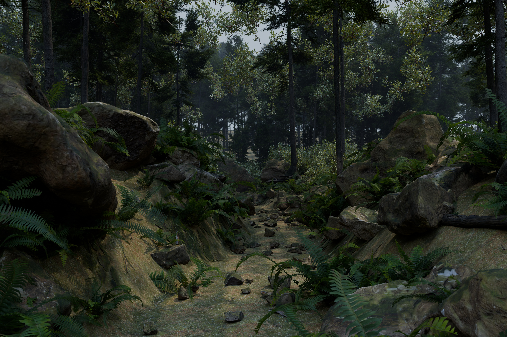

# 森の小道 — realisticNature

Megascansの苔とPoly Havenのスキャン素材を使って制作した、Blender/Cyclesの森林シーンです。添付された森の写真を参考に、岩とシダに囲まれた小道を別の構図で制作しました。



## 開く

`scenes/ForestPath.blend` をBlender 5.2.1以降で開きます。カメラは設定済みです。テンキー0でカメラ表示、F12でレンダリングできます。現在のローカル制作フォルダーには使用素材が配置されています。

ローカル納品の `ForestPath_Local_Packed.blend` は使用画像59点を内蔵しています。このファイルだけでシーンを開けます。公開リポジトリには素材を外部参照する版を保存しています。

| ファイル | 内容 |
|---|---|
| `scenes/ForestPath.blend` | 編集可能な完成シーン、カメラ、照明、マテリアル、配置 |
| `renders/forest_path.png` | 3840×2560、16bit PNG |
| `renders/forest_path.jpg` | 同じレンダリングの軽量な閲覧版 |
| `renders/forest_path_linear.exr` | ローカル納品用のシーンリニア16bit EXR。Git対象外 |
| `tools/build_scene.py` | シード固定のシーン構築スクリプト |
| `tools/render_final.py` | 本レンダリングと素材参照の検証 |
| `tools/fetch_assets.py` | CC0素材の取得 |
| `tools/pack_local.py` | 素材を内蔵するローカル納品版の生成 |
| `tools/validate_scene.py` | 両ファイルを再読込し、画像参照と苔のマスクを確認 |
| `docs/RESEARCH.md` | 調査した手法、採用理由、一次資料 |
| `docs/ASSETS.md` | 使用素材とライセンス、復元方法 |
| `docs/validation.json` | 実行した環境・設定・レンダリング時間 |
| `docs/local_package_validation.json` | 再読込した納品ファイルの検証結果とハッシュ |

## 別のPC・Git cloneから復元する

素材は `assets/` 以下を相対参照しています。公開リポジトリにMegascansのテクスチャ本体は含めません。CC0素材も容量を抑えるためダウンローダーで復元する構成です。

1. Python 3で `python tools/fetch_assets.py` を実行。
2. [Megascans Tileable Moss Patches](https://www.fab.com/listings/a9a94514-dfba-43cb-92bc-c550d79b8d5d) の4Kテクスチャセットを自身のライセンスで取得。
3. ZIP内の `Tileable_Moss_Patches_sfdnqii_4K_*.jpg` を `assets/megascans/moss/` に展開。
4. `scenes/ForestPath.blend` を開く。

再構築とレンダリングは次のコマンドです。BlenderがPATHにない場合は実行ファイルのフルパスを指定してください。

```powershell
blender -b --factory-startup --python tools/build_scene.py -- --preview
blender -b --factory-startup --python tools/render_final.py
```

OptiX対応NVIDIA GPUを想定しています。他のGPUやCPUを使う場合は、BlenderのCyclesデバイスを変更してください。樹木・草・岩は共有メッシュを使います。カメラ外の森林を歩き回る用途の完成マップではなく、このカメラからの静止画を中心に構成しています。遠景の木々も3Dで配置し、HDRIは照明に使用しています。

## 制作上の扱い

画像はこのBlenderシーンの実レンダリングです。スキャン素材、実寸の配置、地表の凹凸、葉の透過、木漏れ日を組み合わせてフォトリアルな見た目を目指しています。
